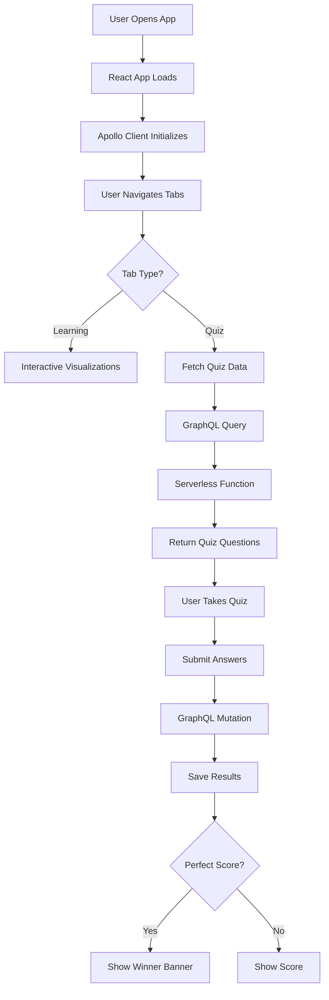

# 🚀 Algo Astra - Technical Architecture & Documentation

<div align="center">


**Navigate the Universe of Algorithms**

[](https://reactjs.org/)
[](https://vitejs.dev/)
[](https://tailwindcss.com/)
[](https://graphql.org/)

An interactive, space-themed educational platform for learning data structures and algorithms through engaging visualizations, real-time interactions, and comprehensive quizzes.

[Live Demo](#) • [Documentation](./Claude.md) • [Deployment Guide](./VERCEL_DEPLOYMENT.md)

</div>

---

## 📑 Table of Contents

- [Overview](#-overview)
- [Tech Stack](#-tech-stack)
- [Architecture](#-architecture)
- [Component Structure](#-component-structure)
- [Features](#-features)
- [Data Flow](#-data-flow)
- [Deployment](#-deployment)
- [Getting Started](#-getting-started)

---

## 🌌 Overview

**Algo Astra** transforms complex algorithmic concepts into interactive, space-themed learning experiences. The application serves learners at all levels—from coding beginners to seasoned engineers preparing for technical interviews.

### Key Concepts

- **Theme**: Space exploration metaphors for data structures
- **Approach**: Learn → Visualize → Practice → Test
- **Audience**: Beginners to advanced software engineers
- **Method**: Interactive visualizations + Comprehensive quizzes

---

## 🛠 Tech Stack

### Frontend

| Technology | Version | Purpose |
|------------|---------|---------|
| **React** | 18.3.1 | Component-based UI framework |
| **Vite** | 5.4.2 | Fast build tool and dev server |
| **Tailwind CSS** | 3.4.1 | Utility-first styling framework |
| **Apollo Client** | 3.11.0 | GraphQL state management |
| **PostCSS** | 8.4.35 | CSS processing and transformation |

### Backend

| Technology | Version | Purpose |
|------------|---------|---------|
| **GraphQL** | 16.9.0 | Type-safe API query language |
| **graphql-http** | 1.22.0 | Modern GraphQL HTTP server |
| **Express** | 4.19.2 | Web server framework |
| **CORS** | 2.8.5 | Cross-origin resource sharing |

### Development & Build

| Tool | Purpose |
|------|---------|
| **@vitejs/plugin-react** | React support for Vite |
| **Autoprefixer** | CSS vendor prefix automation |
| **Node.js** | JavaScript runtime environment |

---

## 🏗 Architecture

### High-Level Architecture

```
┌─────────────────────────────────────────────────────────────┐
│                        CLIENT SIDE                          │
│  ┌─────────────────────────────────────────────────────┐   │
│  │              React Application (Vite)               │   │
│  │                                                      │   │
│  │  ┌──────────┐  ┌──────────┐  ┌──────────┐         │   │
│  │  │  Arrays  │  │  Stacks  │  │  Trees   │         │   │
│  │  │   Tab    │  │   Tab    │  │   Tab    │  ...    │   │
│  │  └──────────┘  └──────────┘  └──────────┘         │   │
│  │                                                      │   │
│  │         ┌────────────────────────┐                  │   │
│  │         │   Apollo Client        │                  │   │
│  │         │   (GraphQL Client)     │                  │   │
│  │         └──────────┬─────────────┘                  │   │
│  └────────────────────┼──────────────────────────────┘   │
└────────────────────────┼──────────────────────────────────┘
                         │
                    HTTP/GraphQL
                         │
┌────────────────────────┼──────────────────────────────────┐
│                SERVER SIDE (Vercel)                        │
│  ┌─────────────────────▼──────────────────────────────┐   │
│  │          Serverless Function (/api/graphql.js)     │   │
│  │                                                      │   │
│  │  ┌──────────────────────────────────────────────┐  │   │
│  │  │         GraphQL Schema & Resolvers           │  │   │
│  │  │                                               │  │   │
│  │  │  • Query: quizResults, lessonContent         │  │   │
│  │  │  • Mutation: saveQuizResult                  │  │   │
│  │  └──────────────────────────────────────────────┘  │   │
│  │                                                      │   │
│  │  ┌──────────────────────────────────────────────┐  │   │
│  │  │         In-Memory Data Store                 │  │   │
│  │  │  (Can be upgraded to Vercel KV/Database)    │  │   │
│  │  └──────────────────────────────────────────────┘  │   │
│  └─────────────────────────────────────────────────────┘   │
└─────────────────────────────────────────────────────────────┘
```

### Application Flow



---

## 🧩 Component Structure

### Project Directory Tree

```
algo-astra/
├── 📁 api/
│   └── graphql.js                    # Vercel serverless GraphQL endpoint
├── 📁 dist/                           # Production build output
│   ├── assets/
│   │   ├── index-[hash].js           # Bundled JavaScript
│   │   └── index-[hash].css          # Compiled CSS
│   ├── index.html                     # Entry HTML
│   └── rocket.svg                     # App icon
├── 📁 public/
│   └── rocket.svg                     # Static assets
├── 📁 server/                         # Standalone server (dev/alternative)
│   ├── index.js                       # Express server
│   └── schema/
│       ├── schema.js                  # GraphQL schema definition
│       └── resolvers.js               # GraphQL resolvers
├── 📁 src/
│   ├── 📁 components/                 # React components
│   │   ├── ArraysTab.jsx             # Arrays & Lists visualization
│   │   ├── StacksQueuesTab.jsx       # Stack/Queue operations
│   │   ├── TreesGraphsTab.jsx        # Tree visualization
│   │   ├── SortingTab.jsx            # Sorting algorithms
│   │   ├── BigOTab.jsx               # Big O complexity guide
│   │   └── QuizTab.jsx               # Interactive quiz system
│   ├── 📁 data/
│   │   └── quizData.js               # Quiz questions & answers
│   ├── 📁 graphql/
│   │   ├── client.js                 # Apollo Client setup
│   │   └── queries.js                # GraphQL queries/mutations
│   ├── App.jsx                       # Main app component
│   ├── main.jsx                      # React entry point
│   └── index.css                     # Global styles + Tailwind
├── index.html                        # HTML entry point
├── vite.config.js                    # Vite configuration
├── tailwind.config.js                # Tailwind configuration
├── vercel.json                       # Vercel deployment config
└── package.json                      # Dependencies & scripts
```

---

## 🎨 Component Structure

### Core Components

#### 1. **App.jsx** - Main Application Container

```javascript
// Responsibilities:
- Tab navigation management
- Global layout and header
- Route/tab rendering logic
- Space theme application
```

**Key Features:**
- Sticky navigation bar
- Tab-based routing (no React Router needed)
- Consistent header with branding
- Footer with project info

---

#### 2. **ArraysTab.jsx** - Arrays & Linked Lists

```javascript
// Interactive Features:
- Array visualizer with index display
- Comma-separated input parsing
- Linked list builder with add/remove nodes
- Visual representation of pointers
```

**Data Structures Demonstrated:**
- Static arrays with zero-based indexing
- Dynamic linked lists with node relationships
- O(1) array access visualization
- O(n) linked list traversal

---

#### 3. **StacksQueuesTab.jsx** - Stack & Queue Operations

```javascript
// Interactive Features:
- Stack with push/pop operations (LIFO)
- Queue with enqueue/dequeue operations (FIFO)
- Animated visual feedback
- Real-time operation tracking
```

**Visualizations:**
- Vertical stack display (top highlighted)
- Horizontal queue display (front/rear markers)
- Color-coded animations for operations
- Size and element tracking

---

#### 4. **TreesGraphsTab.jsx** - Tree Visualization

```javascript
// Interactive Features:
- Binary tree rendering with hierarchical layout
- Collapsible terminology sections
- Tree types and traversal methods
- Visual node connections
```

**Educational Content:**
- Tree terminology (root, parent, child, leaf)
- Tree types (binary, BST, balanced)
- Traversal methods (in-order, pre-order, post-order, level-order)
- Example mission control hierarchy

---

#### 5. **SortingTab.jsx** - Algorithm Visualization

```javascript
// Interactive Features:
- Algorithm selection (Bubble, Quick, Merge, Insertion)
- Real-time sorting animation
- Progress bar tracking
- Randomize and reset functionality
```

**Visualizations:**
- Bar chart representation
- Color-coded states (unsorted, comparing, sorted)
- Step-by-step animation with delays
- Code examples in collapsible panels

---

#### 6. **BigOTab.jsx** - Complexity Analysis

```javascript
// Educational Features:
- Complexity comparison chart (O(1) to O(2^n))
- Interactive expandable cards
- Growth rate comparison table
- Rules of thumb and best practices
```

**Learning Tools:**
- Color-coded complexity levels
- Real-world space analogies
- Numerical growth comparison
- Complexity selection for details

---

#### 7. **QuizTab.jsx** - Assessment System

```javascript
// Quiz Features:
- Topic selection (6 different topics)
- 5 questions per quiz (2 points each)
- Instant feedback with explanations
- Result tracking via GraphQL
```

**Achievement System:**
- Perfect score detection (10/10)
- Winner banner with trophy animation
- Date-stamped achievements
- Quiz history display

---

## 🎯 Features

### Interactive Learning Modules

| Feature | Description | Tech Implementation |
|---------|-------------|---------------------|
| **Array Visualizer** | Input comma-separated values to see indexed array | React state + dynamic rendering |
| **Linked List Builder** | Add/remove nodes with visual pointers | Array manipulation + SVG arrows |
| **Stack Operations** | Push/pop with LIFO visualization | Array + CSS animations |
| **Queue Operations** | Enqueue/dequeue with FIFO display | Array shifting + transitions |
| **Tree Visualization** | Hierarchical binary tree rendering | Recursive component rendering |
| **Sorting Animation** | Watch algorithms sort in real-time | setTimeout async operations |
| **Big O Chart** | Interactive complexity comparison | Expandable card components |
| **Quiz System** | 30 questions across 6 topics | GraphQL mutations for storage |

### Design System

#### Color Palette (Space Theme)

```javascript
colors: {
  space: {
    dark: '#0a0e27',      // Deep space background
    blue: '#1e3a8a',      // Nebula tones
    purple: '#6366f1',    // Cosmic energy
    cyan: '#06b6d4',      // Stellar highlights
    pink: '#ec4899',      // Supernova accents
  }
}
```

#### Animations

- **float**: Vertical oscillation for icons (3s loop)
- **glow**: Opacity pulse for emphasis (2s loop)
- **bounce**: Entry animation for new elements
- **scale**: Hover effect for buttons (1.05x)
- **fade**: Smooth transitions between states

#### Custom Utilities

```css
.space-gradient       /* Background gradient */
.card-space          /* Component card styling */
.btn-space           /* Primary button styling */
.star-field          /* Background star pattern */
```

---

## 🔄 Data Flow

### GraphQL Schema

```graphql
# Types
type QuizResult {
  id: ID!
  topic: String!
  score: Int!
  totalQuestions: Int!
  timestamp: String!
  isPerfectScore: Boolean!
}

type LessonContent {
  id: ID!
  topic: String!
  title: String!
  content: String!
  spaceExample: String!
  keyPoints: [String!]!
}

# Queries
query GetQuizResults {
  quizResults {
    id
    topic
    score
    isPerfectScore
    timestamp
  }
}

query GetLessonContent($topic: String!) {
  lessonContent(topic: $topic) {
    title
    content
    spaceExample
    keyPoints
  }
}

# Mutations
mutation SaveQuizResult($input: QuizResultInput!) {
  saveQuizResult(input: $input) {
    id
    score
    isPerfectScore
  }
}
```

### State Management

#### Local State (React useState)
- Tab navigation
- Component-specific data (arrays, stacks, etc.)
- Animation states
- User input values

#### Global State (Apollo Client Cache)
- Quiz results from server
- Lesson content data
- Mutation responses

### Data Storage

**Current**: In-memory storage (serverless function scope)
- Fast and simple
- Resets on function cold start
- Suitable for demo/testing

**Production Options**:
1. **Vercel KV** (Redis) - Fast, serverless-friendly
2. **Vercel Postgres** - Relational database
3. **MongoDB Atlas** - NoSQL database
4. **Supabase** - PostgreSQL + real-time features

---

## 🚀 Deployment

### Vercel Configuration

```json
{
  "buildCommand": "npm run build",
  "outputDirectory": "dist",
  "framework": "vite",
  "rewrites": [
    {
      "source": "/api/graphql",
      "destination": "/api/graphql.js"
    }
  ]
}
```

### Build Process

1. **Development**: `npm run dev`
   - Vite dev server on port 3000
   - Hot module replacement (HMR)
   - GraphQL server on port 4000

2. **Production Build**: `npm run build`
   - Vite optimizes and bundles code
   - Tailwind purges unused CSS
   - Output to `dist/` directory
   - Assets hashed for caching

3. **Deployment**: Automatic via Vercel
   - GitHub integration triggers build
   - Serverless functions deployed
   - CDN distribution worldwide
   - HTTPS automatic

### Environment Variables

```bash
# Optional - defaults to /api/graphql in production
VITE_GRAPHQL_URL=https://your-api.com/graphql
```

---

## 🏃 Getting Started

### Prerequisites

- Node.js 18+
- npm or yarn
- Git

### Installation

```bash
# Clone the repository
git clone https://github.com/AllisonMH/algo-astra.git
cd algo-astra

# Install dependencies
npm install

# Start development servers
npm run dev        # Frontend (port 3000)
npm run server     # GraphQL server (port 4000)
```

### Development Workflow

```bash
# Run frontend only (uses serverless function in production)
npm run dev

# Run standalone GraphQL server (for local development)
npm run server

# Build for production
npm run build

# Preview production build locally
npm run preview
```

### Project Scripts

| Command | Description |
|---------|-------------|
| `npm run dev` | Start Vite dev server |
| `npm run build` | Build production bundle |
| `npm run preview` | Preview production build |
| `npm run server` | Run standalone GraphQL server |

---

## 📊 Performance Metrics

### Bundle Size

```
dist/assets/index.js     401.01 kB (118.32 kB gzipped)
dist/assets/index.css     25.02 kB (  4.87 kB gzipped)
Total                    426.03 kB (123.19 kB gzipped)
```

### Lighthouse Scores (Target)

- **Performance**: 90+
- **Accessibility**: 95+
- **Best Practices**: 100
- **SEO**: 90+

### Optimizations

- Code splitting with dynamic imports
- Lazy loading for components
- CSS purging with Tailwind
- Asset optimization (images, SVG)
- Gzip compression
- Browser caching with hashed filenames

---

## 🔐 Security Considerations

### Current Implementation

- CORS enabled for all origins (development)
- No authentication required (educational demo)
- In-memory storage (no persistence)
- GraphQL endpoint publicly accessible

### Production Recommendations

1. **Restrict CORS**: Limit to your domain
2. **Rate Limiting**: Prevent abuse
3. **Input Validation**: Sanitize user inputs
4. **Database Security**: Use environment variables
5. **Content Security Policy**: Add CSP headers

---

## 🧪 Testing Strategy

### Manual Testing Checklist

- [ ] All tabs render correctly
- [ ] Interactive features respond to input
- [ ] Animations play smoothly
- [ ] Quiz questions display properly
- [ ] Score calculation is accurate
- [ ] GraphQL mutations save data
- [ ] Perfect score banner appears
- [ ] Responsive on mobile devices

### Future Testing Additions

- Unit tests with Vitest
- Component tests with React Testing Library
- E2E tests with Playwright
- GraphQL schema validation
- Accessibility testing with axe

---

## 🎓 Educational Content

### Quiz Topics

1. **Arrays & Lists** (5 questions)
   - Zero-based indexing
   - Array access time complexity
   - Linked list pointers
   - Dynamic arrays

2. **Stacks & Queues** (5 questions)
   - LIFO vs FIFO principles
   - Operation complexities
   - Use cases and applications
   - Circular queues

3. **Trees & Graphs** (5 questions)
   - Binary tree properties
   - Tree traversals
   - BST operations
   - Graph representations

4. **Sorting Algorithms** (5 questions)
   - Algorithm comparisons
   - Time complexities
   - Stability considerations
   - Best use cases

5. **Big O Notation** (5 questions)
   - Complexity analysis
   - Growth rate comparisons
   - Common complexities
   - Optimization techniques

6. **Comprehensive Practice** (5 questions)
   - Mixed topics
   - Real-world scenarios
   - Interview-style questions
   - Problem-solving

---

## 🤝 Contributing

### Areas for Contribution

- Additional data structures (heaps, hash tables)
- More quiz questions
- Code challenge integration
- User authentication
- Database integration
- Internationalization (i18n)
- Dark mode toggle
- Achievement badges system

---

## 📝 License

Open Source - Built for the coding community

---

## 🙏 Acknowledgments

**Built with:**
- React ecosystem
- Tailwind CSS community
- GraphQL community
- Space exploration inspiration

**Special Thanks:**
- The beauty of space for visual inspiration
- The elegance of algorithms for content
- The joy of learning for purpose

---

<div align="center">

**Algo Astra** - Where Space Meets Algorithms ✨

Made with ❤️ by the coding community

[⬆ Back to Top](#-algo-astra---technical-architecture--documentation)

</div>
